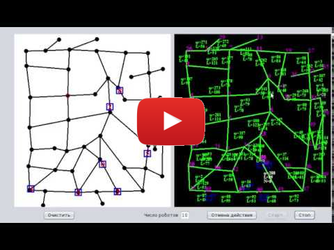

# Лабиринт
Целью работы является разработка программного комплекса для моделирования системы распределения задач в коллективе роботов, исследующих лабиринт с целью построения карты помещения.
Написана на **Java**, среда разработки - NetBeans.  
Программа была создана в рамках научно-исследовательской работы в магистратуре. 
## Возможности:  
- задание произвольного лабиринта;  
- выбор любого числа роботов;  
- визуализация движения роботов в лабиринте и их знаний о нём;  
- исследование одного и того же лабиринта разным числом роботов;  
- построение гистограмм времени исследования лабиринта разным числом роботов, количества пройденного пути каждым роботом;  
- сохранение лабиринта в файл с возможностью последующей загрузки.  

## Требования:  
- **Java 8**.

  
  
Барашков А.А., 2016
